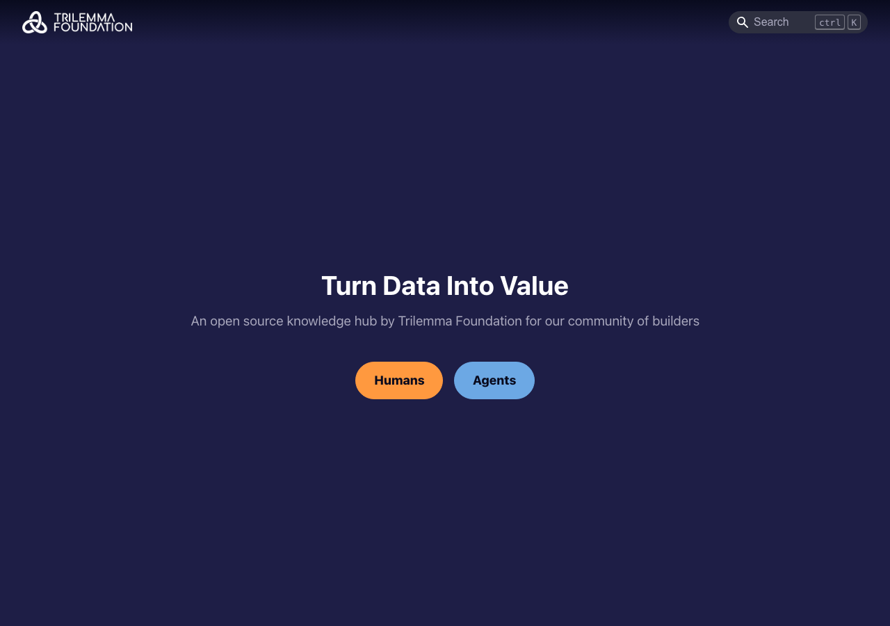
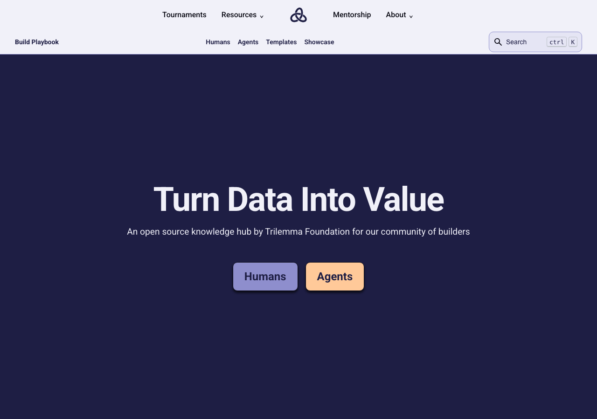
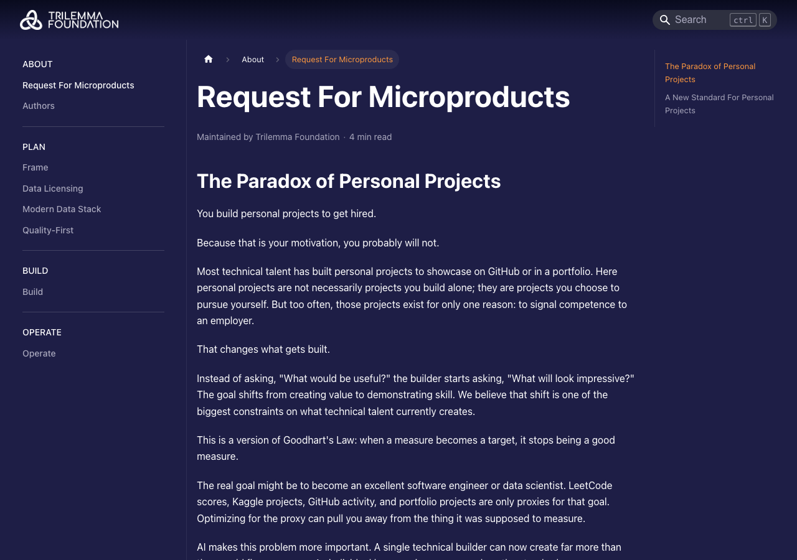
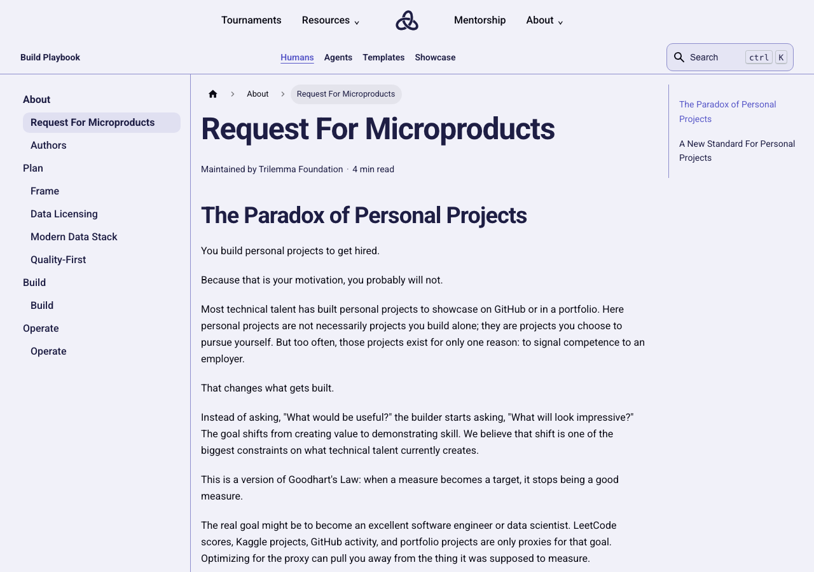
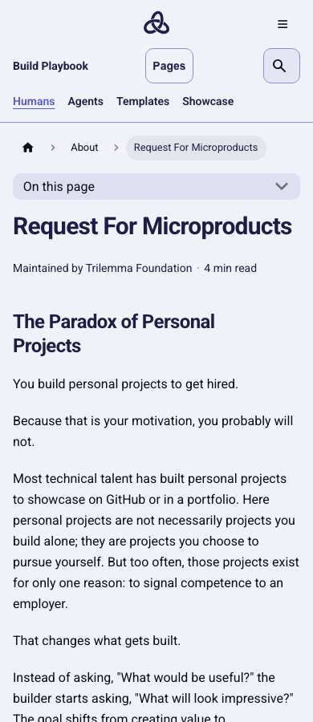

# Foundation experience unification — design contract 1.0.0

> **Current navigation (contract 1.1.0):** Data and Playbook now render only
> their local subdomain header. The Foundation header is not imported by either
> app. The common footer remains. The double-header screenshots and validation
> below are historical evidence from the original 1.0.0 migration.

Implemented September 5, 2026. The canonical reference is the rendered Foundation
landing at `website_v2` revision `c6b1b7da2d8ca4c3c1d53b4912a91f45de9e0b1e`.
The applications remain separate repositories with independent builds and releases.

## Design and implementation

The versioned [contract](../src/design/README.md) contains portable CSS tokens,
shared chrome styles, navigation destinations, interaction rules, and SHA-256
checksums. `npm run check:design` verifies local bytes and semantic framework
mappings. For a coordinated release, run this from any app:

```sh
node scripts/check-design-contract.mjs --peers /path/to/other-app /path/to/third-app
```

The Foundation React adapter retains its existing shell. Data uses Next links and
server-rendered page content with a client navigation adapter. Playbook uses the
native Docusaurus routers, sidebars, search index, and document generators. Each
app vendors its own contract; no sibling runtime imports or component package is
required. Playbook's browser suite is also part of its CI workflow.

| Element | Verified treatment |
| --- | --- |
| Content / text | Ghost white `#F1F1F9` / ink `#0A0A14` |
| Feature panels | Navy `#1E1E44` / ghost-white text |
| Primary button | Periwinkle `#8E8ECD` / navy; azure `#5858C8` / ghost white on hover |
| Secondary button | Peach / navy; amber / navy on hover |
| Focus | Azure on light content; amber on navy features |
| Typography | Roboto interface and prose; monospace code |
| Shape | 10px controls, 16px cards; 44px minimum controls |
| Navigation | Centered Foundation mark and grouped site links; local Data/Playbook row |
| Reading | Light content, consistent heading rhythm, independently scrollable code |

The primary hover pair measures approximately **5.13:1**, correcting the previous
2.75:1 pair. Essential native field borders use azure. Selected Playbook sidebar
text uses navy, avoiding low contrast on the tinted selected background. Code
highlighting uses the same semantic palette in both saved Docusaurus theme modes.

## Coverage

[The route inventory](routes.json) is derived from the actual React router and role
catalog, or the fresh static HTML output. It includes all generated documentation
plugin instances, mirrors, author and tag pages, dataset guides, and fallback
probes. Generated files and public content formats were not edited to apply styles.

| Surface | Route smoke coverage | Representative visual / interaction coverage |
| --- | --- | --- |
| Foundation | 16 routes, including redirect and invalid-role/unknown-route probes | Landing, projects, People, opportunities and all four roles, mentorship, legal prose, fallbacks |
| Data | 178 static HTML routes; additionally all 159 dataset guides checked for mobile overflow | Catalog, filters/sort/pagination/history, collections, themes, guide variants, contribution studio, 404 |
| Playbook | 51 generated HTML routes | Home, human/agent docs and mirrors, templates, archetypes, standards, contribution, showcase, authors, search, 404 |

Chromium covers widths 320, 390, 768, 1023, 1024, 1280, and 1536px. Short-screen
checks cover 1024×600 for Foundation and mobile landscape menus. Firefox and WebKit
cover representative layouts and interactions. Text is tested at 200% scaling,
with narrow reflow, keyboard navigation, and reduced motion. This is automated
text scaling, not a claim that browser chrome zoom was manually exercised on every
route. Full route smoke coverage is broader than the representative screenshot set.

State checks include focus, disclosure/drawer opening and closing, focus restoration,
background isolation, selected/disabled controls, empty results, pagination/history,
loading, failed requests and retry, validation, successful mocked submissions,
clipboard success/failure, contribution download failure, and long content.
Application submissions use intercepted endpoints; no real applications were sent.

Existing lazy-loading checks and Data asset/input-latency budgets are retained.
Axe checks cover Data's catalog, mobile menu/filter dialog and reading/form families,
and Playbook's reading, search, feature, sidebar and code surfaces. Automated
accessibility checks supplement the visual/keyboard checks; they do not establish
that every possible content combination has been manually reviewed.

## Release and rollback

The current changes are local and uncommitted. Production deployment is separate.
Release each repository using its normal workflow after checking contract parity.
Retain each previous deployment artifact for rollback; no data migration, API
payload change, dataset schema change, or machine-readable document change is
required. The `2026` app is outside this work.

Run fresh builds before capturing screenshots. The optional `REFERENCE_URL`
environment variable enables comparisons against a served archive of the recorded
original revision. It is only a browser-test input and is never used at runtime.

## Playbook changes and evidence

Docusaurus/Infima now use the Foundation palette, Roboto, light prose, navy feature
areas, rectangular canonical actions and the shared footer. The homepage has one
h1. Native plugin sidebars, breadcrumbs, anchors, author metadata, search exclusions,
and previous/next navigation remain. The theme applies across all plugin instances.

Site and page navigation are separate overlays. The page drawer now isolates the
covered content, sits above both navigation rows, handles Escape and restores focus.
Code controls retain native code content and add readable copy success/error feedback.
The canonical light syntax palette corrects the previous low-contrast boolean color.







Validation: `npm run check`; `npm run test:coverage` (45 Jest tests and 103 script
tests, with existing 100% coverage gates); production-build Playwright suite in
Chromium, Firefox and WebKit. The final check/build/coverage run used Node 22.18.0.
Framework chrome and copy adapters use real-browser coverage instead of JSDOM
coverage, consistent with the existing navbar exclusion. The contract checker has
100% script coverage, including local drift, peer mismatches and invalid mappings.

Final browser result: **87 passed**, 10 intentionally skipped browser-duplicate cases. See [validation summary](results.json).

## UI Fix follow-up

See the [UI Fix follow-up](ui-fix-follow-up.md) for the subsequent rendered audit,
additional repairs, and validation scope. The screenshots above record the initial
unification pass; the follow-up evidence records later corrections.
