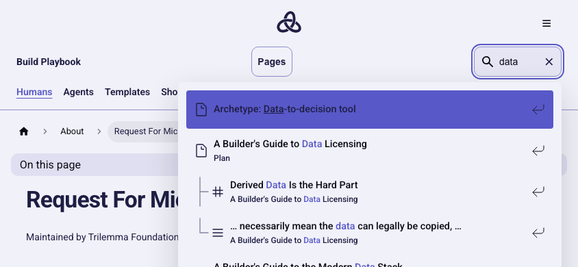
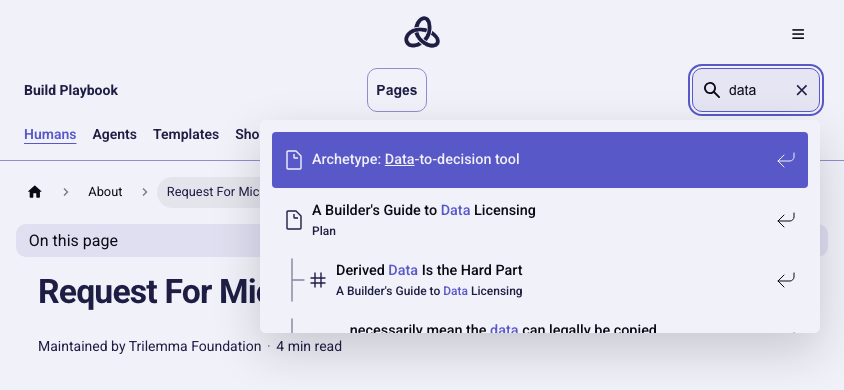

# UI Fix follow-up — September 5, 2026

This pass reviewed the local, uncommitted design-unification changes in Foundation,
Data, and Microproduct Lab. Existing changes were preserved. Production, the 2026
app, external submissions, and machine-readable content were outside this pass.
The shared design contract remains version 1.0.0; its bytes and cross-app parity
are unchanged.

## Coverage and evidence

The existing route inventories and production-browser suites were rerun. Route
smoke checks inspect the rendered DOM; they are not a claim of individual visual
review of all 245 routes. The seven-width Chromium family matrices, representative
Firefox/WebKit checks, reduced-motion and 200% text-reflow checks remain in place.
Actual browser chrome zoom and mobile virtual keyboards were not exercised.

| Surface / task | State and data | Viewports | Source | Inspection |
| --- | --- | --- | --- | --- |
| Foundation landing and interior families | Mocked APIs/submissions; loading, errors, forms, menus, legal reading | Existing seven-width matrix and short screens | `src/components/pages`, `e2e` | Full 97-check suite passed; live mentorship composition reviewed; no additional source repair |
| Data catalog, collections, themes, guides, contribution, fallbacks | Generated catalog, filters/history, empty results, copy/download recovery | Seven widths; 390×844, 844×390 and 1280×800 anchor checks | `src/components`, `e2e/design-experience.spec.ts` | 178-route smoke and family suite; catalog, Build Paths, guide jump and contribution visually inspected |
| Playbook documentation plugins, mirrors, home, templates, authors, search and fallbacks | Generated documents; keyboard search, selected result, Escape, resumed typing, code-copy recovery | Seven widths; 390×844, 844×390 and 1024×600 search checks | `src/theme/Navbar/Content`, `src/css/custom.css`, `e2e/experience.spec.ts` | 51-route smoke and family suite; documentation, templates, search page and suggestion states visually inspected |

All surfaces use the agreed light-content/navy-feature theme and require no sign-in.
The route lists are in [routes.json](routes.json), and the initial migration's
broader evidence remains in [README.md](README.md). No new product functionality,
router, dependency, public URL, or submission contract was introduced.

## Confirmed repairs

- Playbook selected search text was navy on azure (about 2.75:1). It now uses ghost
  white, including matched terms and icons (about 5.13:1).
- At 844×390, the 556px search panel ended at y=676. It now fits the available
  viewport and scrolls. Native browser scrolling keeps keyboard-selected options
  fully visible; the plugin's own calculation overcounts panel padding.
- Search Escape dismissal now restores the query focus without reopening the
  suggestions. Typing resumes the search. Native focus suppression is scoped to
  that synchronous restoration only; normal subsequent focus behavior remains.
- Data's input token and field utilities now use azure boundaries. Removed the
  ineffective base-layer declaration and the catalog search's competing override.
  Playbook's search field uses the same boundary color.
- Dataset guide jumps no longer add the obsolete 96px fixed-header margin to the
  shared shell offset. The section now starts 32px below the measured shell.
- Contribution selectors keep each label directly above its control. At 390px,
  the previous flex layout stranded the Difficulty label on the Theme row.

Focused regressions assert actual computed colors, panel/selected-item visibility,
keyboard recovery, anchor geometry, and label/control placement. The full existing
UI suites retain mocked submission, accessibility, asset, history, and performance
checks. New search checks also run Axe with an active suggestion selection.

## Validation and repair evidence

`npm run check` passed with Node 22.18.0: types, spelling, content validation,
markdown lint, 45 Jest tests, 103 script tests, fresh build and artifact validation.
The targeted search regression passed in Chromium, Firefox and WebKit, including
Axe, keyboard scrolling, Escape focus and resumed typing.

Both captures use `/docs/request-for-microproducts`, query `data`, light theme
and 844×390. Arrow-key navigation additionally verifies the final result is fully
visible inside the scrolling panel.

Final `npm run test:e2e -- --workers=3`: **89 passed, 11 skipped**. Skips are
10 redundant non-Chromium widths and the opt-in original-reference capture.

## Working-tree change review

The subsequent Repo Change Review fixed two shared-header edge cases: choosing
the current app's home link now restores focus to the site-menu toggle, and
Data's auxiliary catalog information is inert while the site menu is open.
Auxiliary content outside main/footer can opt into isolation with
`data-foundation-background`. Both framework adapters retain the same behavior.
The contract already requires isolation and focus restoration; no contract bytes,
public routes, content formats, or submission APIs changed.

The ordinary development review reran Foundation `check`, `typecheck`, and `test`
(828 tests); Data `lint`, `test` (533 tests), and a fresh build; and Playbook's
required `check` (45 Jest + 103 script tests, docs checks and build). Targeted
browser navigation regressions passed in Chromium, Firefox, and WebKit: 10 Data
and 15 Playbook checks. This was not a repeat of the full release browser matrix.
README links, design behavior, generated-content rules, CI commands and validation
reports were checked. All edits remain local and uncommitted.
