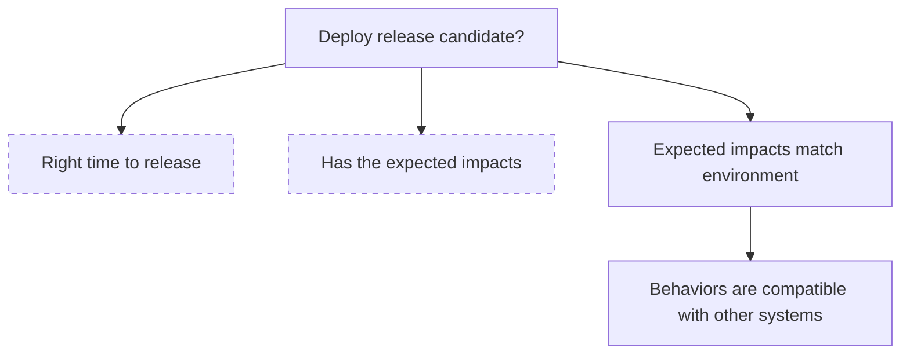
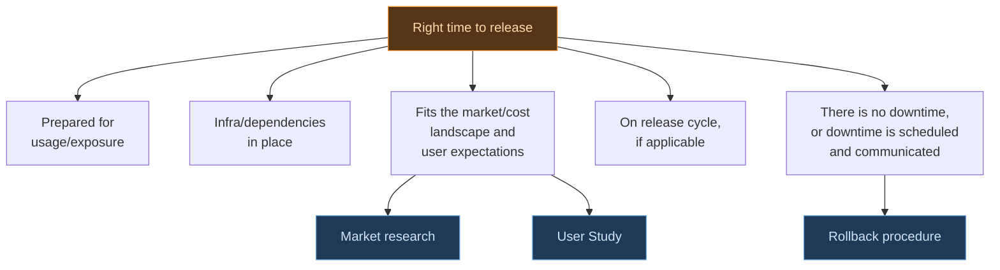
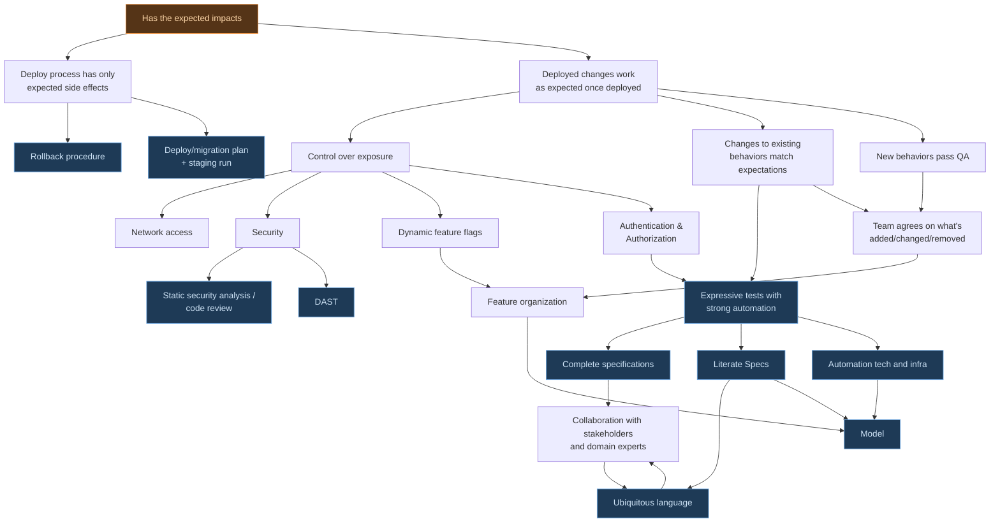

## When to Use This Module

Use this module during Phase 2 (Build) when you have a release candidate and
need to answer one question: **Should we release?**

Deploying changes to production marks the end of one iteration cycle. Bringing
value to users is the main driver for iterating in the first place. Release
decision gates inform the components that make up high-quality software and
analytics pipelines operating in production.

This framework applies to any type of release — small or large projects, new
features or infrastructure upgrades, initial launch or iterative updates. The
highest-risk aspects of releases are the ones you do not think about. The
checklist is a safety net that helps you cover all aspects of putting software
into the world at every iteration.

Use these tools in a way that matches your needs and always make your own
judgments about releasing. A node drawn with a dashed border is a branch of its
own, expanded in a later diagram.

Terms used in the diagrams are defined below.

## The Big Picture

The top-level checklist breaks down into a few large categories that can be
assessed more or less independently. These align with the distinction between
"building the right thing" and "building the thing right."

## Timing

This topic covers both the fit of the product with respect to the external world
and internal preparedness.

## Impacts

The largest category in depth. This covers the actual changes realized as a
result of doing a release.

## Terms

*Release Candidate*: (RC) A snapshot of source code (including static configuration files and deployment scripts) being evaluated for release. Usually a tagged commit.

*Exposure*: Potential consequences of having the changes in the world. Includes costs from people using the software or legal implications.

*Infra(structure)*: Other resources controlled by you that must be present for the code to work. Usually these are cloud resources such as AWS S3 buckets, message brokers.

*Release Cycle*: A regular cadence, or specific times at which teams release or are allowed to release.

*Impacts*: Any results of releasing the RC. Include updating code running on servers, changing configurations, mutating cloud resources, and even running scripts to manipulate data where appropriate. Adding, modifying, or removing a feature is an impact. Making a website exist on a domain that did not exist before is also an impact. So is fixing a bug.

*Downtime*: Any time when previously available and/or expected functionality is not available (even if no users try to use it). Commonly, this is a service outage where a server cannot be reached, but other examples include bugs that make a feature inaccessible or prevent it from working properly.

*Rollback*: Reverting deployed instances to the previous release candidate — effectively removing the effects of the release. This is typically done when a release immediately causes downtime once deployed and a previous release candidate is considered stable.

*QA*: Testing done on **net-new** behaviors and other release impacts, whether by humans or by bots, mostly to glue together stakeholder expectations and actual developed results. QA can be done by a developer if they are the stakeholder. Although the term is used quite broadly in the industry, for the purposes of this framework we exclude regression testing and other types of release checks. We instead deal with changes to existing behaviors in a separate branch of the tree.

*Existing Behaviors*: Things the software does as of the last stable release. These are what users already expect or come to expect, and include behaviors that may not be intended. Unintended behaviors should largely be avoided by following a structured design and specification process.

*Feature Organization*: The team's system for defining what is a feature. Vertical slicing is one possible system. The idea is to have units of behavior that can be individually tested and turned on or off (see feature flags). It is important to have a model for this.

*Model*: An external blueprint of the software, graphical or otherwise. It is common for the model to describe the *shape* of the software while not describing its *texture*. Software models are useful for design, collaboration, testing, and describing a system to builder agents (see more in the [Design](/docs/playbook/design) module). Event models are a strong example that highlights information flow.

*Expressive Tests*: Tests whose source code — or data, in the case of something like Gherkin/Cucumber — tell a lot about what they do and, by extension, what the software does. These give confidence to stakeholders, serve as executable specifications, and prove why they exist (not something that can be said for many tests in industry codebases).

*Strong Automation*: Test automation that ensures the test actually tests what it says, and gets deep enough that we get confidence even without using the software ourselves. One of the strongest forms of automation is E2E testing using Playwright — since it tests fully integrated flows — but those are relatively expensive and are not the only type of strong automation. Getting this right relies on good technology and infrastructure that effectively separates business logic from wiring.

*Literate Specification*: Descriptions about software shape and behavior that are well-organized and can be understood by everyone on the team. Require a good model.

*Complete Specification*: Descriptions about software shape and behavior that eliminate as much uncertainty as possible. Must capture everything that stakeholders expected — current, and ideally going into the future as well.

*Ubiquitous Language*: Terms, phrases, and ways of communicating that are collaboratively built up between domain experts, stakeholders, and developers. The goal is for everyone on the team to be able to talk. Developers should use the language of the business when naming things, asking questions, and interpreting tests. You can learn more about this from the DDD community.

## Next Step

Follow the [Deploy Quickstart](./deploy-quickstart) to ship your release candidate.

[Propose an improvement](https://github.com/TrilemmaFoundation/microproduct-lab/pulls)
